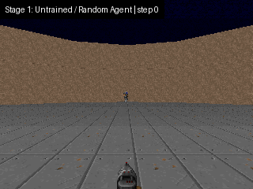
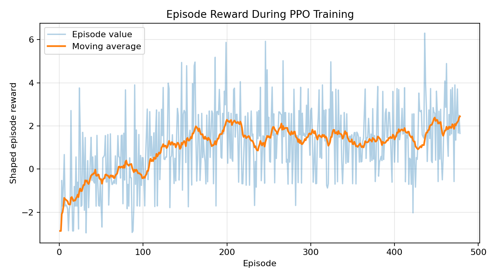
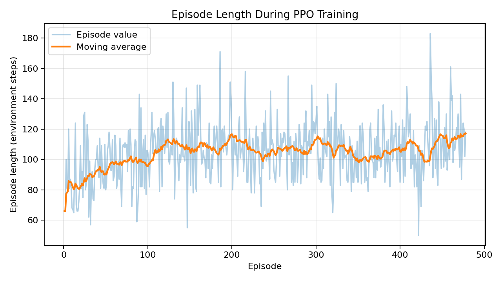
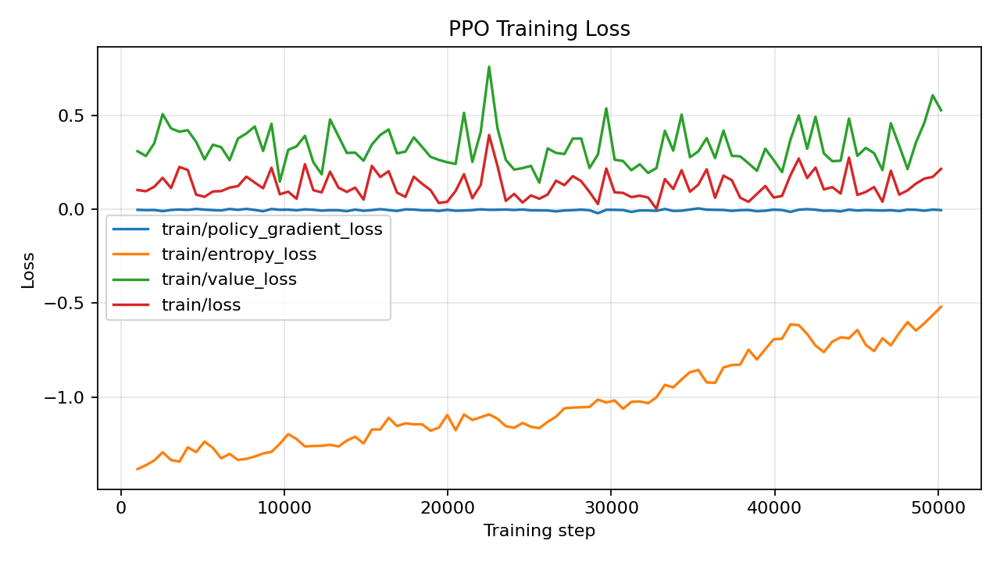

# 🧠 Visual Survival RL Agent in ViZDoom

<p align="center">
  
</p>

<p align="center">
  <b>Student:</b> &lt;Your Name&gt; &nbsp; | &nbsp;
  <b>Course:</b> CMP4501 &nbsp; | &nbsp;
  <b>Track:</b> Option B – Visual Survival with ViZDoom
</p>

---

## 1. Project Summary

This project trains a reinforcement learning agent to survive in a visual ViZDoom environment using only raw screen observations. The agent learns to turn, aim, and shoot enemies while managing two important survival resources: health and ammunition.

The project is intentionally designed as a realistic semester project rather than a large research system. It uses a compact PPO implementation, grayscale frame preprocessing, frame stacking, and a small convolutional neural network so that training can run on a normal laptop CPU.

---

## 2. Problem Description

The goal is to learn a policy:

$$
\pi(a_t \mid s_t)
$$

that selects an action from visual observations in order to survive as long as possible and use ammunition efficiently. The agent does not receive symbolic information such as enemy positions. Instead, it must infer useful behavior from stacked image frames.

The main challenges are:

- visual perception from pixels,
- delayed consequences of shooting and turning,
- sparse native rewards,
- resource management under limited ammunition,
- unstable behavior early in training.

---

## 3. Environment Description

**Environment:** `VizdoomDefendCenter-v1`

This scenario places the player in the center of a circular arena. Enemies approach from the outside, and the agent must rotate and shoot them before losing health. The scenario is suitable for this course project because it is visually meaningful but still simple enough for CPU training.

Why this scenario was selected:

- It is a true ViZDoom visual-control task.
- It includes health and ammunition, matching the survival/resource-management theme.
- It uses a small action set, which improves reliability for student training.
- It is easier to train than full Deathmatch while still being more interesting than a toy task.

---

## 4. Observation / State Representation

The raw ViZDoom observation is a screen image. The project converts it into a compact visual state:

$$
s_t = [I_{t-3}, I_{t-2}, I_{t-1}, I_t]
$$

where each frame is:

- converted to grayscale,
- resized to `84 × 84`,
- stored as unsigned 8-bit pixels,
- stacked over the last 4 frames.

This gives the CNN short-term motion information, such as whether enemies are moving closer or whether the agent is turning.

---

## 5. Action Space

The selected scenario provides a small discrete action space:

| Action | Meaning |
|---:|---|
| 0 | Turn left |
| 1 | Turn right |
| 2 | Shoot |

This action space is deliberately small. A larger action set would increase exploration difficulty and make CPU-only training less reliable.

---

## 6. Custom Reward Function

The shaped reward used by the wrapper is:

$$
R_t =
w_s S_t
+ w_d D_t
+ w_i I_t
- w_h H_t
- w_a A_t
- w_{death} P_t
$$

where the default weights are:

| Symbol | Config name | Value | Meaning |
|---|---|---:|---|
| $w_s$ | `survival` | 0.01 | Small reward for staying alive each step |
| $w_d$ | `damage_dealt` | 1.00 | Reward for successful hits/kills from the native ViZDoom signal |
| $w_i$ | `item_pickup` | 0.50 | Reward for health gain if the scenario provides items |
| $w_h$ | `health_lost` | 0.02 | Penalty for losing health |
| $w_a$ | `ammo_used` | 0.01 | Penalty for wasting ammunition |
| $w_{death}$ | `death_penalty` | 2.00 | Penalty when the episode ends because the agent dies |

### Reward Term Explanation

- $S_t$ encourages the agent to stay alive instead of behaving randomly.
- $D_t$ encourages aiming and shooting enemies.
- $I_t$ keeps the reward function reusable for item-based survival scenarios.
- $H_t$ discourages standing still and absorbing damage.
- $A_t$ discourages constant shooting without aiming.
- $P_t$ makes death clearly worse than temporary damage.

This reward encourages survival, efficient shooting, and resource management without making the task overly complex.

---

## 7. Algorithm Choice

### Selected Algorithm: PPO

This project uses **Proximal Policy Optimization (PPO)** with a CNN policy.

PPO was selected instead of DQN because:

- PPO is reliable for image-based control tasks.
- Stable-Baselines3 provides a strong, tested PPO implementation.
- PPO supports CNN policies directly.
- The clipped objective helps avoid unstable policy updates.
- It works well with frame stacking and vectorized environments.

DQN would also be possible because the action space is discrete, but PPO is generally easier to stabilize for this visual control project.

---

## 8. CNN Architecture

The model uses a compact CNN feature extractor:

| Layer | Output channels | Kernel | Stride | Activation |
|---|---:|---:|---:|---|
| Conv2D | 16 | 8×8 | 4 | ReLU |
| Conv2D | 32 | 4×4 | 2 | ReLU |
| Conv2D | 64 | 3×3 | 1 | ReLU |
| Flatten | - | - | - | - |
| Linear | 256 | - | - | ReLU |

The actor and critic then use separate MLP heads with 128 hidden units each.

This architecture is intentionally smaller than many research CNNs so that it remains practical on CPU.

---

## 9. Hyperparameters

| Hyperparameter | Value |
|---|---:|
| Algorithm | PPO |
| Policy | CNN policy |
| Total timesteps | 200,000 |
| Learning rate | 2.5e-4 |
| Rollout steps | 512 |
| Batch size | 64 |
| PPO epochs | 4 |
| Discount factor $\gamma$ | 0.99 |
| GAE lambda | 0.95 |
| Clip range | 0.20 |
| Entropy coefficient | 0.01 |
| Value loss coefficient | 0.50 |
| Max gradient norm | 0.50 |
| Frame skip | 4 |
| Frame stack | 4 |
| Image size | 84×84 |
| Device | CPU |
| Seed | 42 |

---

## 10. Training Process

Training is split into two phases:

1. Save the initialized untrained model.
2. Train for half of the total timesteps and save `half_trained.zip`.
3. Continue training and save `fully_trained.zip`.
4. Generate plots from monitor logs.
5. Record videos for all three stages.
6. Combine sampled video frames into `assets/evolution.gif`.

Expected CPU time depends on hardware. On a typical laptop CPU, 200,000 timesteps may take roughly 1–4 hours. For quick testing, use 10,000–30,000 timesteps.

---

## 11. Training Graphs

### Reward Plot

<p align="center">
  
</p>

### Episode Length Plot

<p align="center">
  
</p>

### Loss Plot

<p align="center">
  
</p>

---

## 12. Analysis of Training Behavior

The expected learning pattern is:

- **Early training:** the agent turns and shoots almost randomly. Episode rewards are low because the agent wastes ammunition and dies quickly.
- **Middle training:** the agent begins to rotate toward enemies and sometimes shoots successfully, but it still misses often.
- **Late training:** the agent survives longer, shoots more selectively, and obtains higher shaped reward.

The reward curve may be noisy because enemies spawn from different directions and visual policies require exploration. The moving average is more useful than individual episode values. Episode length is important because the scenario is survival-based; longer episodes usually indicate better defensive behavior.

After running the project, the graphs in `assets/` should be inspected and this section can be updated with exact numbers from the local training run.

---

## 13. Challenges and Failures

A common failure during development was reward sparsity. With only the default environment reward, the agent often learned slowly because it received useful positive feedback only when it successfully hit or killed enemies.

Another issue was inefficient shooting. Early agents often fired continuously, which looked active but wasted ammunition.

---

## 14. How the Problems Were Solved

The project addresses these issues with reward shaping:

- a small survival bonus provides dense feedback,
- health loss is penalized,
- ammunition use is penalized,
- successful native positive rewards are treated as the damage term,
- death receives an additional penalty.

The visual input is also simplified with grayscale resizing and frame stacking. This reduces computation while preserving enough information for learning.

---

## 15. Installation

Create and activate a virtual environment:

```bash
python -m venv .venv
source .venv/bin/activate
```

On Windows PowerShell:

```powershell
python -m venv .venv
.\.venv\Scripts\Activate.ps1
```

Install dependencies:

```bash
pip install --upgrade pip
pip install -r requirements.txt
```

> **Windows note:** this project intentionally installs `stable-baselines3` without the `[extra]` option. The extra option pulls Atari-only packages such as `ale-py`, which are not needed for ViZDoom and can fail to build on Windows.


---

## 16. How to Train

Full training:

```bash
python -m src.train --timesteps 200000 --seed 42
```

Quick smoke test:

```bash
python -m src.train --timesteps 10000 --seed 42
```

Training creates:

```text
models/untrained.zip
models/half_trained.zip
models/fully_trained.zip
assets/reward_plot.png
assets/episode_length_plot.png
assets/loss_plot.png
logs/training.monitor.csv
logs/progress.csv
```

---

## 17. How to Evaluate

Evaluate the fully trained model:

```bash
python -m src.evaluate --model models/fully_trained.zip --episodes 10
```

Evaluate a random baseline:

```bash
python -m src.evaluate --random --episodes 10
```

Evaluate the half-trained checkpoint:

```bash
python -m src.evaluate --model models/half_trained.zip --episodes 10
```

---

## 18. How to Record Videos and GIF

Record all three required stages:

```bash
python -m src.record_video --stage all
```

This creates:

```text
videos/untrained.mp4
videos/half_trained.mp4
videos/fully_trained.mp4
assets/evolution.gif
```

Record only one stage:

```bash
python -m src.record_video --stage full
```

---

## 19. How to Regenerate Plots

```bash
python -m src.utils --plot
```

---

## 20. Repository Structure

```text
vizdoom-rl-survival/
│
├── README.md
├── requirements.txt
├── .gitignore
├── src/
│   ├── __init__.py
│   ├── train.py
│   ├── evaluate.py
│   ├── record_video.py
│   ├── model.py
│   ├── config.py
│   ├── wrappers.py
│   └── utils.py
│
├── assets/
│   ├── evolution.gif
│   ├── reward_plot.png
│   ├── episode_length_plot.png
│   └── loss_plot.png
│
├── videos/
│   ├── untrained.mp4
│   ├── half_trained.mp4
│   └── fully_trained.mp4
│
├── models/
│   ├── untrained.zip
│   ├── half_trained.zip
│   └── fully_trained.zip
│
└── logs/
```

---

## 21. Reproducibility Notes

The project sets random seeds for Python, NumPy, PyTorch, and the Gymnasium environment. Exact results may still differ slightly across operating systems and CPU/GPU backends, but the seed makes runs more consistent.

---

## 22. Final Conclusion

This project demonstrates a complete applied reinforcement learning workflow: selecting an environment, defining states and actions, designing a reward function, training a PPO agent, saving training checkpoints, recording evolution videos, plotting learning curves, and presenting results in a professional GitHub report.

The final system is intentionally practical and CPU-friendly, making it appropriate for CMP4501 as a semester project rather than an overly ambitious research implementation.
